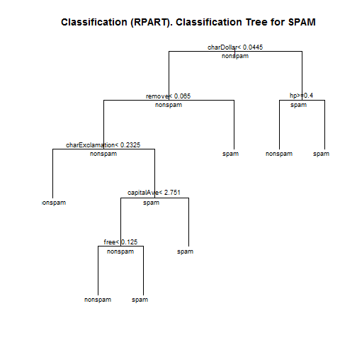

## Introduction

This assignment uses data from Spam E-mail Detabase collected at Hewlett-Packard Labs, that classifies 4601 e-mails as spam or non-spam. 
In addition to this class label there are 57 variables indicating the frequency of certain words and characters in the e-mail. 

This shiny apps allows you to enter the frequency of some variables to predict if the mail is either "nonspam" or "spam".

--- .class #id 

## Data

The first 48 variables contain the frequency of the variable name (e.g., business) in the e-mail. If the variable name starts with num (e.g., num650) the it indicates the frequency of the corresponding number (e.g., 650). 
The variables 49-54 indicate the frequency of the characters ';', '(', '[', '!', '\$', and '#'. The variables 55-57 contain the average, longest and total run-length of capital letters. Variable 58 indicates the type of the mail and is either "nonspam" or "spam", i.e. unsolicited commercial e-mail.

--- 

## Classification Tree
Use the classification tree to find what variables can be used to determine the type of email (nonspam or spam).


```
## Rattle: A free graphical interface for data mining with R.
## Version 3.4.1 Copyright (c) 2006-2014 Togaware Pty Ltd.
## Type 'rattle()' to shake, rattle, and roll your data.
```

 

--- 

## Predicting with Support Vector Machines model
Produce SVM model using the svm function. The SVM model is 90% accurate on the training data.

```
## Confusion Matrix and Statistics
## 
##           Reference
## Prediction nonspam spam
##    nonspam     892  108
##    spam         39  494
##                                           
##                Accuracy : 0.9041          
##                  95% CI : (0.8883, 0.9184)
##     No Information Rate : 0.6073          
##     P-Value [Acc > NIR] : < 2.2e-16       
##                                           
##                   Kappa : 0.7948          
##  Mcnemar's Test P-Value : 2.04e-08        
##                                           
##             Sensitivity : 0.9581          
##             Specificity : 0.8206          
##          Pos Pred Value : 0.8920          
##          Neg Pred Value : 0.9268          
##              Prevalence : 0.6073          
##          Detection Rate : 0.5819          
##    Detection Prevalence : 0.6523          
##       Balanced Accuracy : 0.8894          
##                                           
##        'Positive' Class : nonspam         
## 
```
